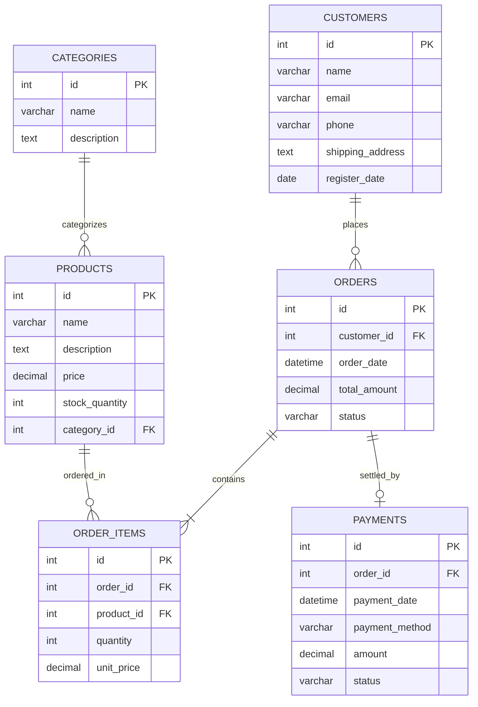

# Database Diagram --- Sistem E-commerce

Dokumentasi ini dibuat oleh: **Hanifa_Ramadhani**

Database yang digunakan pada sistem ini adalah **Sistem E-commerce**

## Entity Relationship Diagram

## Penjelasan

### Customers

Menyimpan informasi pelanggan yang terdaftar, termasuk alamat pengiriman dan kontak.

### Categories

Menyimpan kategori produk (misalnya: Elektronik, Pakaian, Makanan) untuk memudahkan pengelompokan.

### Products

Menyimpan detail produk yang dijual, harga, serta jumlah stok yang tersedia di gudang.

### Orders

Menyimpan data transaksi utama yang dilakukan oleh pelanggan, termasuk tanggal transaksi dan status pesanan (misal: Pending, Shipped, Completed).

### Order Items

Menyimpan rincian produk apa saja yang dibeli dalam satu nomor pesanan (tabel ini menangani hubungan many-to-many antara Orders dan Products).

### Payments

Menyimpan informasi pembayaran untuk setiap pesanan, termasuk metode pembayaran (Transfer Bank, Kartu Kredit, E-Wallet) dan status pembayarannya.

---

_Dokumen ini dibuat sebagai bagian dari proyek Sistem E-Commerce oleh Hanifa Ramadhani_
