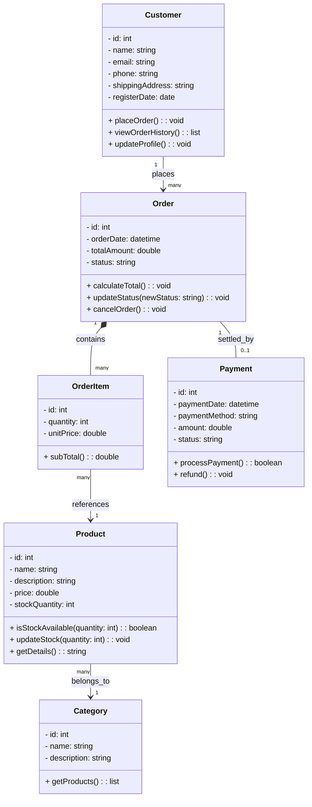

# Class Diagram --- Sistem E-commerce

Dokumentasi ini dibuat oleh: **Hanifa Ramadhani**

Class diagram menggambarkan struktur class dalam aplikasi **Sistem E-commerce**

## Penjelasan

### Customer

Merepresentasikan pelanggan yang terdaftar di sistem. Memiliki kemampuan untuk melakukan pesanan, melihat riwayat belanja, dan mengelola profil pribadi.

### Category

Digunakan untuk mengelompokkan produk. Satu kategori dapat memiliki banyak produk (misalnya: Elektronik, Fashion, atau Peralatan Rumah Tangga).

### Product

Merepresentasikan barang yang dijual. Menyimpan informasi harga dan stok. Memiliki logika untuk mengecek apakah stok mencukupi sebelum pesanan diproses.

### Order

Merepresentasikan transaksi belanja. Kelas ini mengelola status pesanan (Pending, Dikirim, Selesai) dan menghitung total biaya dari seluruh item yang dibeli.

### Orderitem

Merupakan rincian produk dalam satu pesanan tertentu. Menyimpan jumlah (quantity) dan harga satuan pada saat transaksi terjadi (untuk menghindari masalah jika harga produk berubah di masa depan).

### Payment

Menangani informasi pembayaran pelanggan. Mencatat metode yang digunakan (seperti Transfer Bank atau E-Wallet) dan status keberhasilan transaksi pembayaran.

---

_Dokumen ini dibuat sebagai bagian dari proyek Sistem E-commerce oleh Hanifa Ramadhani_
