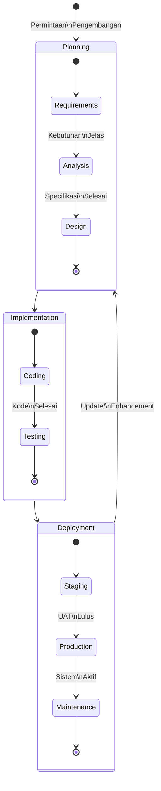
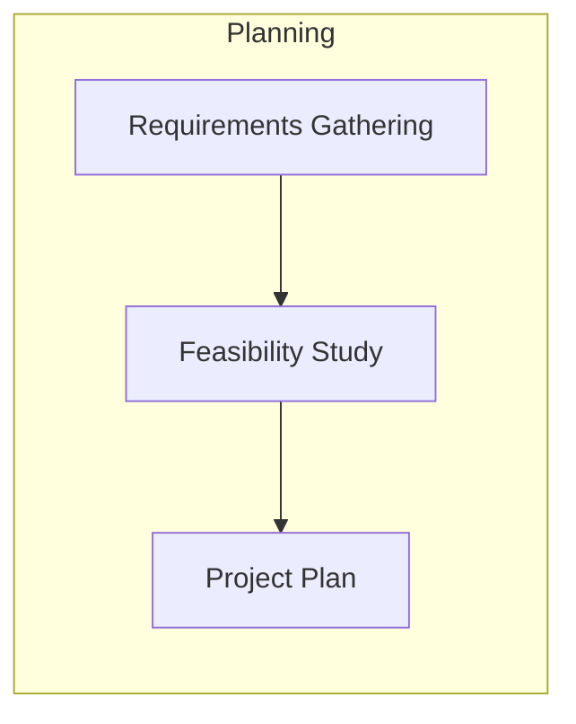
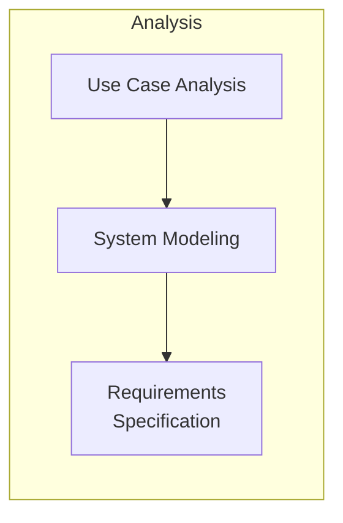
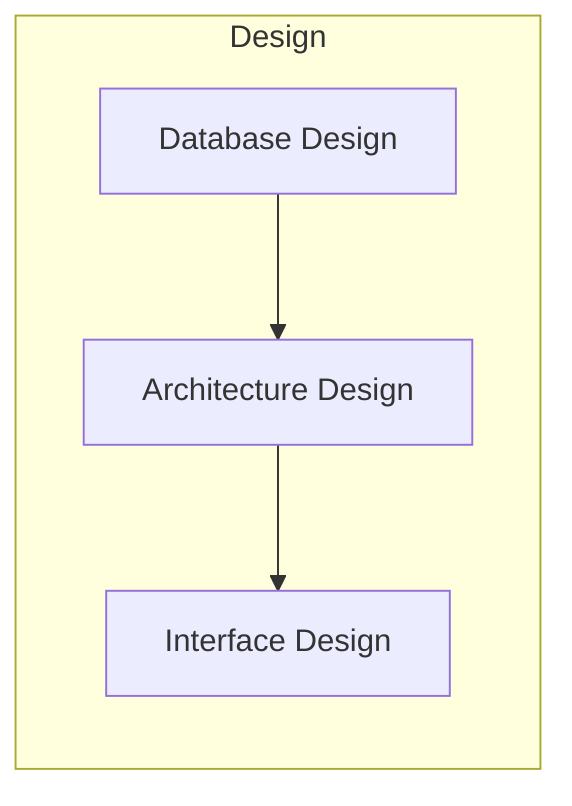
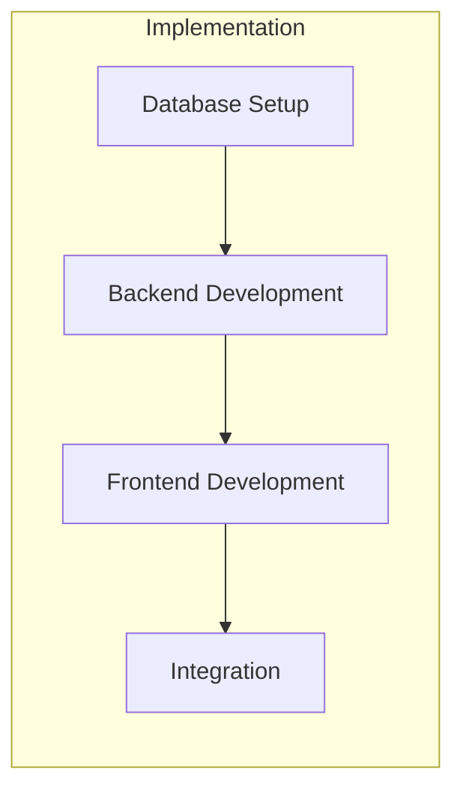
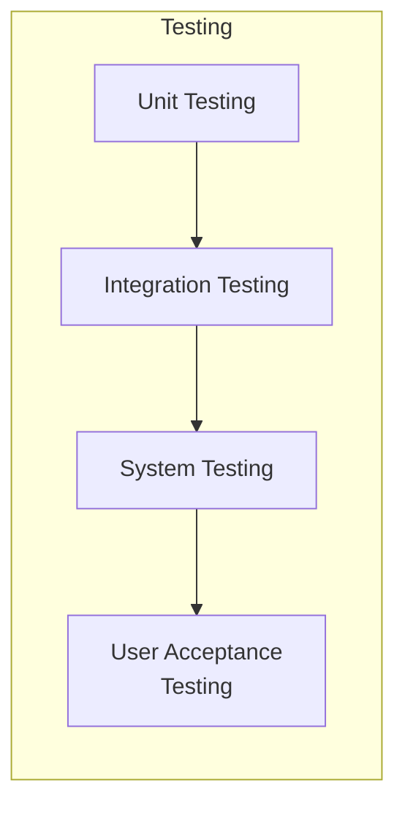
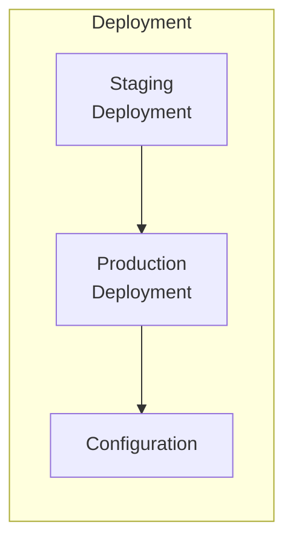
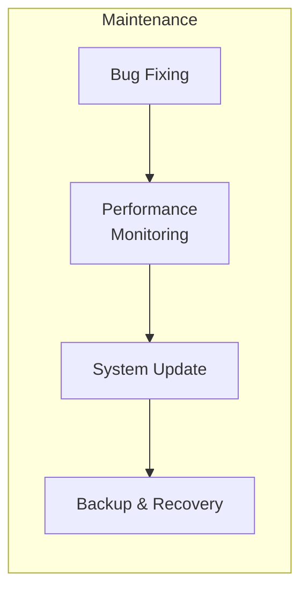
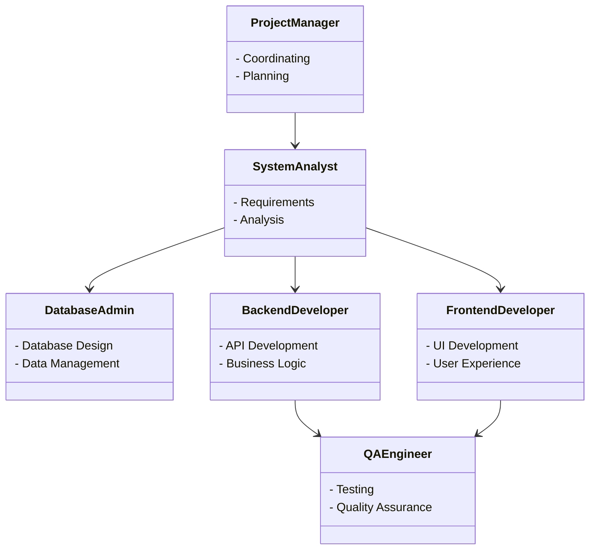
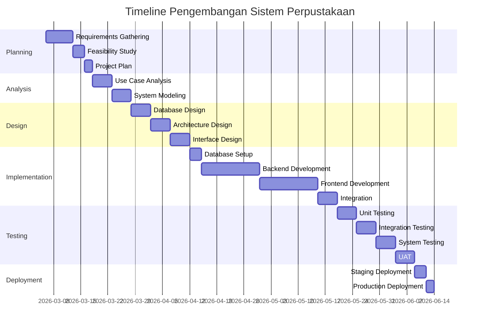

# SDLC Process --- Sistem Ecommerce

Dokumentasi ini dibuat oleh: **Hanifa Ramadhani**

Dokumentasi ini menjelaskan proses SDLC (Software Development Life Cycle) untuk pengembangan aplikasi Sistem e-commerce.

## Tahapan SDLC

## Detail Tahapan

### 1. Planning (Perencanaan)

**Aktivitas:**

- Mengumpulkan kebutuhan bisnis
- Analisis kelayakan proyek
- Membuat rencana proyek dan timeline

### 2. Analysis (Analisis)

**Aktivitas:**

- Analisis kebutuhan fungsional dan non-fungsional
- Membuat use case diagram
- Membuat spesifikasi sistem

### 3. Design (Desain)

**Aktivitas:**

- Desain database (Entity Relationship Diagram)
- Desain arsitektur aplikasi
- Desain antarmuka pengguna

### 4. Implementation (Implementasi)

**Aktivitas:**

- Setup database MySQL
- Pengembangan backend API
- Pengembangan frontend
- Integrasi sistem

### 5. Testing (Pengujian)

**Aktivitas:**

- Unit testing setiap komponen
- Integration testing antar modul
- System testing keseluruhan sistem
- User Acceptance Testing (UAT)

### 6. Deployment (Penempatan)

**Aktivitas:**

- Deploy ke environment staging
- Konfigurasi production
- Deploy ke production server

### 7. Maintenance (Pemeliharaan)

**Aktivitas:**

- Perbaikan bug
- Monitoring performa sistem
- Update sistem
- Backup dan recovery data

## Tim Pengembangan

## Timeline Pengembangan

## Deliverables

| Tahapan        | Deliverables                                                |
| -------------- | ----------------------------------------------------------- |
| Planning       | Project Charter, Requirements Document                      |
| Analysis       | Use Case Diagram, SRS (Software Requirements Specification) |
| Design         | ERD, Class Diagram, Architecture Document                   |
| Implementation | Source Code, Database Schema, API Documentation             |
| Testing        | Test Cases, Test Reports, Bug Reports                       |
| Deployment     | Deployment Guide, Configuration Guide                       |
| Maintenance    | System Documentation, User Manual                           |

---

_Dokumen ini dibuat sebagai bagian dari proyek Sistem Ecommerce oleh Hanifa Ramadhani_
